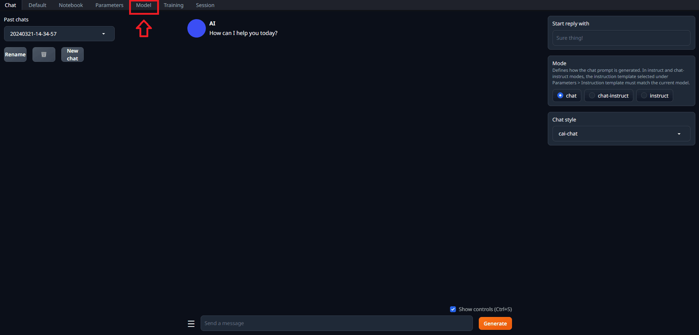
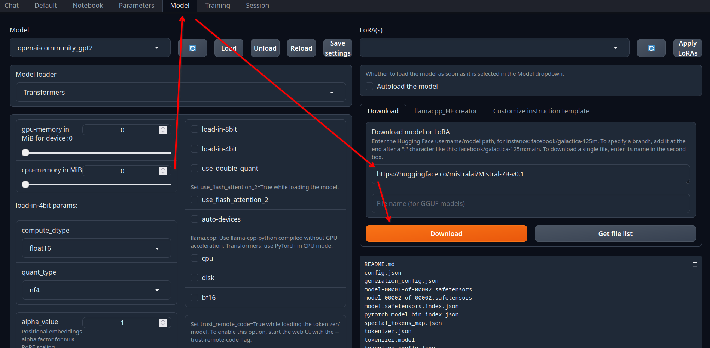
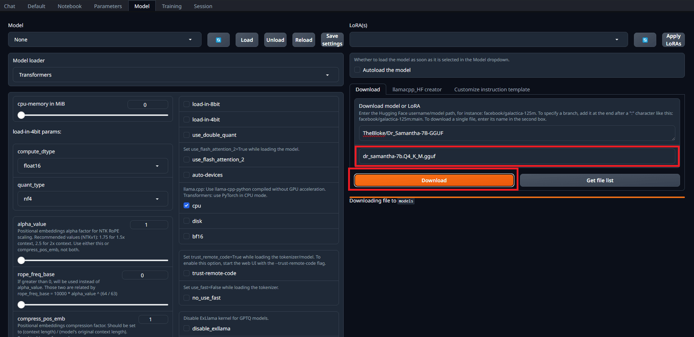
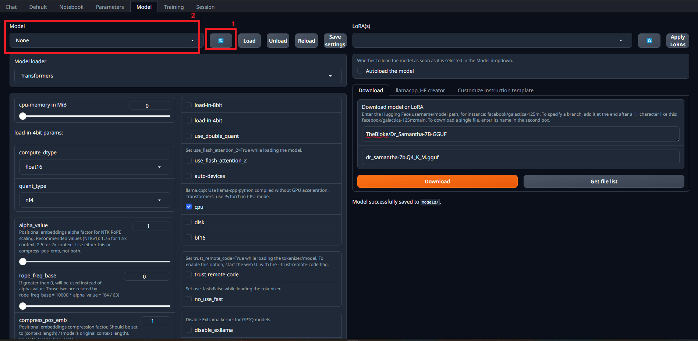
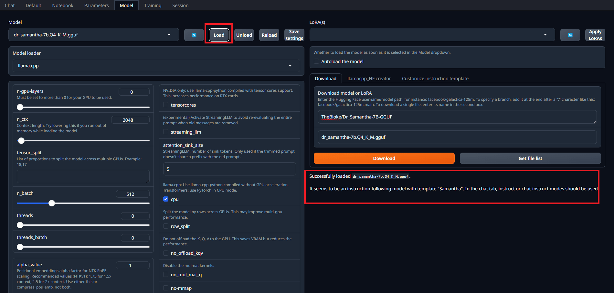
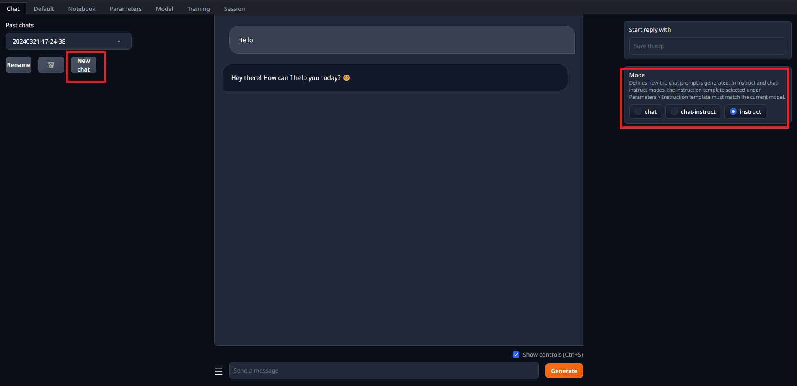

# Running Models with the Text Generation WebUI

1. Download a model

   - If you don't have any models in your device yet, you can download it directly in the Models tab

     - First access the `Model` tab

       

     - Paste the link of the model download page in the `Download` box

       - You can find many open models at [Hugging Face](https://huggingface.co/models?pipeline_tag=text-generation&sort=downloads)

         - For example, you can download the lightweight `openai-community/gpt2` model from [here](https://huggingface.co/openai-community/gpt2)

         - Or for more robust tasks you can download the `mistralai/Mistral-7B-v0.1` model from [here](https://huggingface.co/mistralai/Mistral-7B-v0.1)

         - For a balanced performance you can use `TheBloke/Mistral-7B-v0.1-GGUF` with `mistral-7b-v0.1.Q4_K_M.gguf` quantization from [here](https://huggingface.co/TheBloke/Mistral-7B-v0.1-GGUF)

     - Click in the `Download` button to download the model:
       

     - If it is a `GGUF` model you must select one file from the file list:
       

       - Choose witch you want to download:
         

     - Download it :
       

   - If you prefer, you can download the model by command line with the command `python download-model.py {organization}/{model-name}`

   - If you're using the [Google Colab](https://colab.research.google.com/github/oobabooga/text-generation-webui/blob/main/Colab-TextGen-GPU.ipynb) notebook, you can download the model by passing the model download url as the `model_url` parameter

2. Organize your models

   - If you already have a model in your device, you can copy it to the `text-generation-webui/models` directory

   - Single file models like `GGUF` should be placed directly into the models folder

   - Multiple files models should be placed in a folder with the model name

     - Place all the `.json`, `.bin`, `.model` (and others) files downloaded for the model in the same folder

   - If you prefer to keep all your models in another folder, you can specify the path to this folder by running the script with the `--model-dir /path/to/your/models` flag

     - For example, for using your cached models in the Hugging Face Hub directory, you can run the script with the `--model-dir` flag and passing `~/.cache/huggingface/hub` as argument

3. Select the model in dropdown in the `model` tab

   - If you already know what model you want to use when starting the application, you can specify the model by running the script with the `--model model-name` flag

     - For example, for using the `llama-2-13b-chat.Q4_K_M.gguf` model, you can run the script with the `--model` flag and passing `llama-2-13b-chat.Q4_K_M.gguf` as argument

   - Click in the "reload" button to update the list of models after downloading or placing new models in the `text-generation-webui/models` directory:
     - 

4. When selecting a model, the Text Generation WebUI will automatically select a Model Loader suitable for it

   - If you want to use a specific Model Loader, you can select it in the dropdown in the `model` tab

   - You tweak the configurations of the Model Loader for optimizing performance and compatibility for your hardware

   - Each Model Loader has different set of configurations and parameters, but most of them allow for selecting options for using CPU, GPU, VRAM and RAM limits, quantization and other helpful configurations

5. After selecting the model and the Model Loader and configuring all parameters, you can click in `Load` to load the model:

   - 

     - You might need to click on `reload` for the models to appear in the dropdown after making changes to the models directory

   - Check your terminal for any error messages or warnings

   - If you get a Memory Error, you may need to tweak your configurations like reducing the VRAM or RAM limits, using CPU instead of GPU, or using quantization

   - If all fails, try to use smaller models that require less resources to work properly

6. When the model is successfully loaded, you can start using it in the other tabs of the application

   - 

   - You can use the `Chat`, `Default` and `Notebook` interfaces to run text-to-text tasks in the loaded model

   - You can use chat templates to help you with some common tasks

   - You can use the `Training` tab to fine tune models

   - You can use the `Parameters` tab to configure the model inference parameters

   - You can use the `Session` tab to manage extensions
