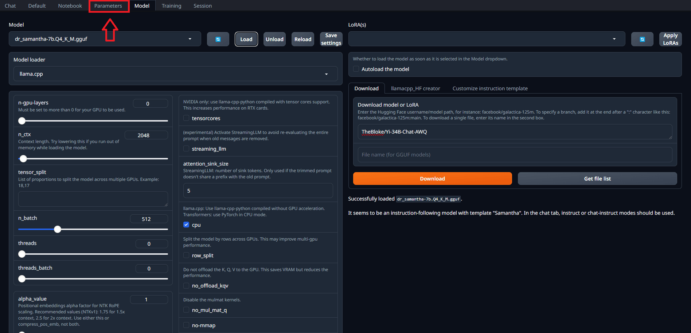
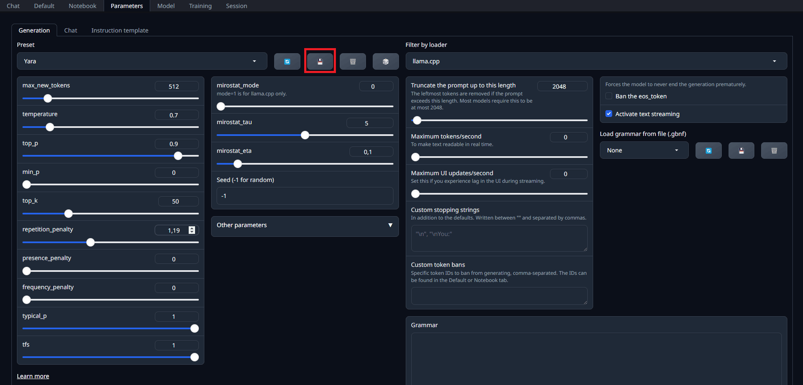
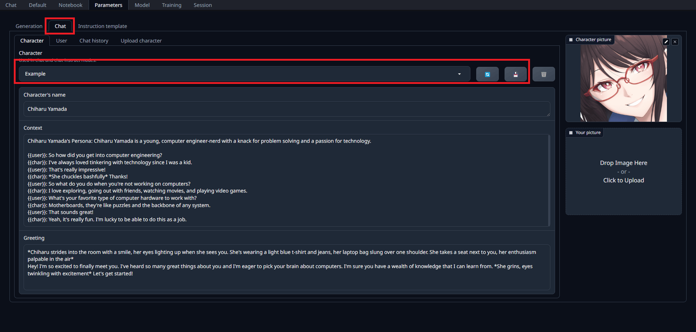

# Using Text Generation WebUI to Chat with an Assistant

1. Open the `Parameters` tab

   - Make sure that you have a model loaded before proceeding
   - 

2. Configure the model inference parameters

   - Set the `max_new_tokens` to `512` to limit the length of the generated text

   - Set the `temperature` to `0.7` to control the randomness of the generated text

   - Set the `top_k` to `50` to control the diversity of the generated text

   - Set the `top_p` to `0.9` to control the diversity of the generated text

   - Save the parameters in a `preset` for future use
   - 

3. Configure the `Chat Character` tab

   - 

   - Give a name to your assistant

     - This is going to be the AI display name in the chat interface

   - Provide context to guide the behavior of the assistant

   - Customize the greeting message and the avatar image, if you want

   - Hit save to create the new character

4. Open the `Chat` tab

5. Click in the `Show controls` checkbox

6. Scroll down to see the control options

7. Click on `Refresh` in the `Character gallery` pane

8. Select the assistant you just created

9. Click in `New Chat` to start a new conversation with that assistant

10. Type a message in the chat interface and hit `Generate`

11. If you don't like the response generated, you can click in the Hamburger button before the text input and select `Regenerate`

12. If you want the assistant to continue generating messages without a new prompt, you can click `Continue`
