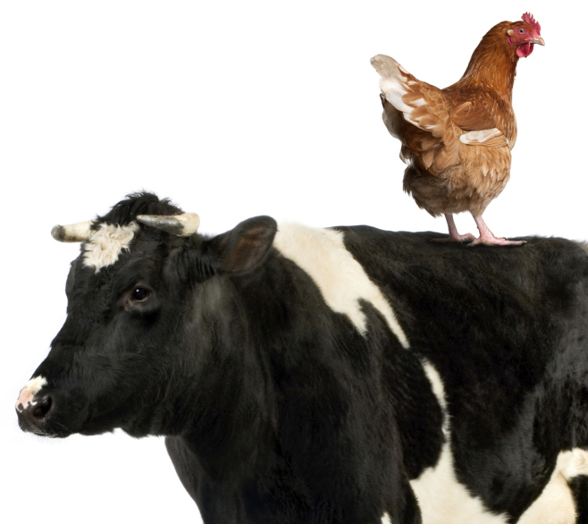
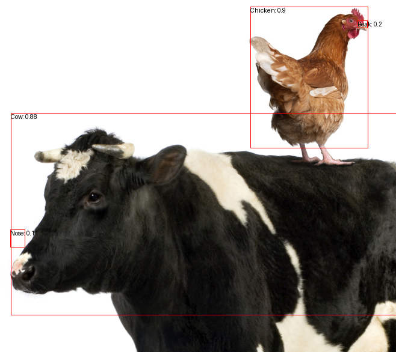

# Running a Zero-shot Object Detection Pipeline

1. Load the `venv` environment where you have installed `transformers` in previous lessons

2. Create a python file named `ObjectDetection.py`

3. Import the needed libraries

   ```python
   import sys
   from transformers import pipeline
   from PIL import Image, ImageDraw
   ```

4. Import the model and define the pipeline

   ```python
   checkpoint = "google/owlv2-base-patch16-ensemble"
   detector = pipeline(model=checkpoint, task="zero-shot-object-detection")
   ```

5. Load the image passed as argument to the script

   ```python
   filename = sys.argv[1]
   image = Image.open(filename)
   ```

6. Receive the list of objects to detect as user input

   ```python
   labels = input("Enter the labels you want to detect: ").split(" ")
   ```

   - The list of words must be separated by single spaces

7. Run the pipeline and get the results

   ```python
    predictions = detector(
        image,
        candidate_labels=labels,
    )
   ```

8. Draw the bounding boxes on the image

   ```python
   draw = ImageDraw.Draw(image)
   for prediction in predictions:
       box = prediction["box"]
       label = prediction["label"]
       score = prediction["score"]

       xmin, ymin, xmax, ymax = box.values()
       draw.rectangle((xmin, ymin, xmax, ymax), outline="red", width=1)
       draw.text((xmin, ymin), f"{label}: {round(score,2)}", fill="black")
   ```

9. Save the image with the bounding boxes

   ```python
   image.save(f"{filename.split('.')[0]}_detection.png")
   ```

10. Run the script with the image file

    ```bash
    python ObjectDetection.py CowChicken.png
    #Enter the labels you want to detect: Cow Chicken Nose Beak
    ```

    - Example input:

      

    - Example output:

      
