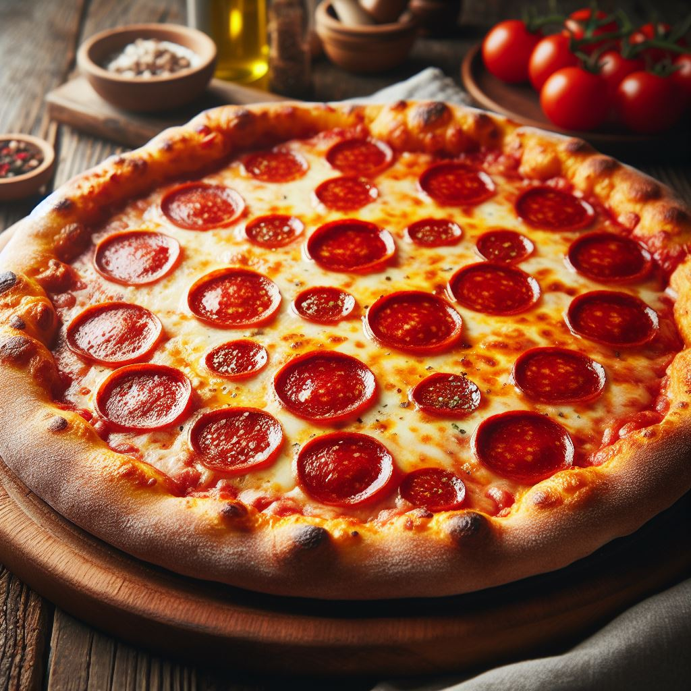
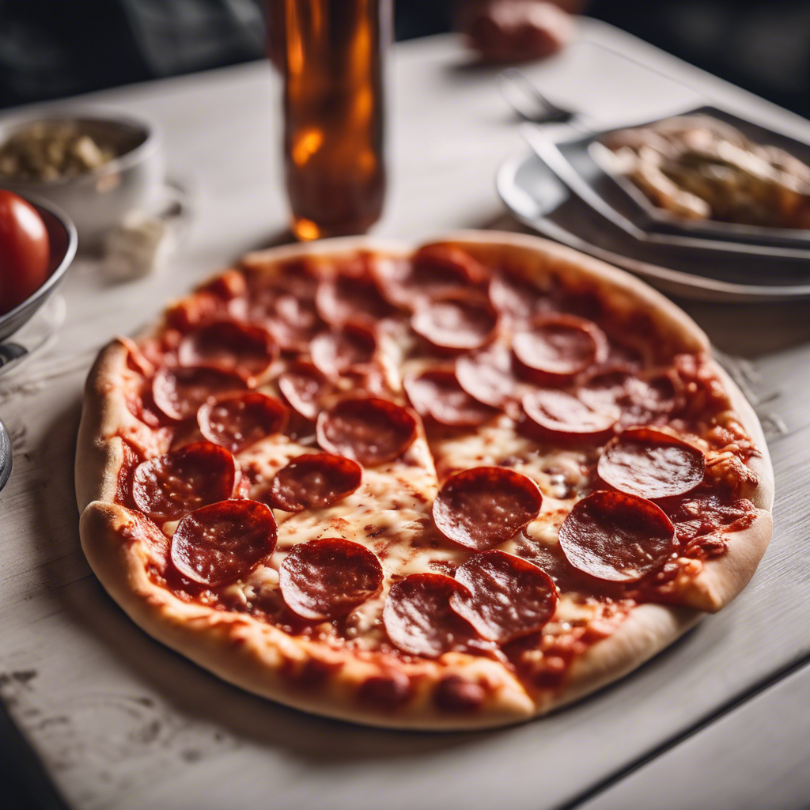
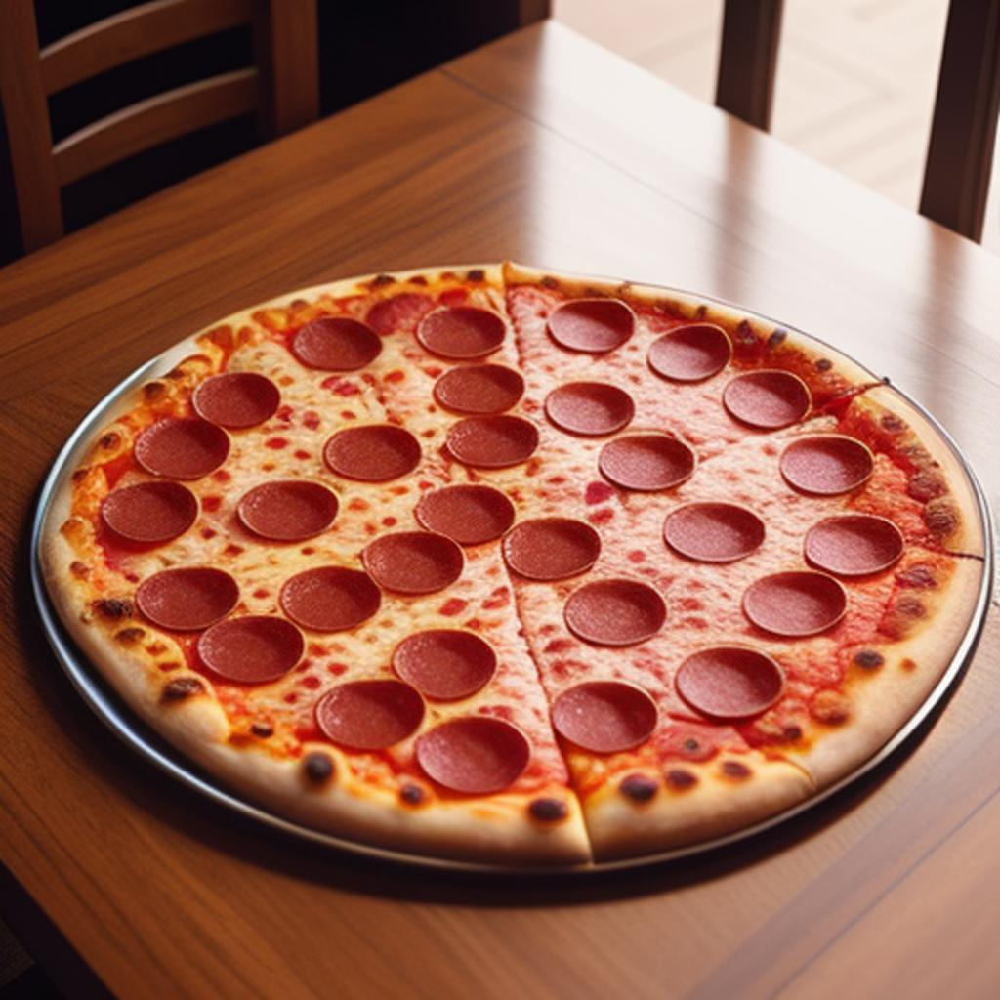

# Generating Images with AI

## Using DALL·E-3 with Image Creator (from Bing)

1. Sign up to [Copilot Designer](https://www.bing.com/images/create)

2. Describe the image you want to create in the input bar

3. View the results

   - Example of image generated from the prompt `A picture of a Pepperoni Pizza on a restaurant table`:

   

## Using SDXL 1.0 with DreamStudio (from Stability.ai)

1. Sign up to [DreamStudio](https://beta.dreamstudio.ai/generate)

2. Describe the image you want to create in the prompt text box

3. Select the style you want to apply to the image

4. Select an aspect ratio and image count

- Example of image generated from the prompt `A picture of a Pepperoni Pizza on a restaurant table` with a `Photographic` style and a `1:1` aspect ratio:

## Generating Images with Picsart

1. Sign up to [Picsart](https://picsart.com/create/editor)

2. Click on `New Canvas +` to create a new blank project

3. Click on the `Photos` tab and choose `Generate with AI`

4. Describe the image you want to create in the input box

5. Choose the size and aspect ratio of the image

6. Choose the styles you want to apply to the image

- Example of image generated from the prompt `A picture of a Pepperoni Pizza on a restaurant table` with a `Ultra detailed` style and a `1:1` aspect ratio:

