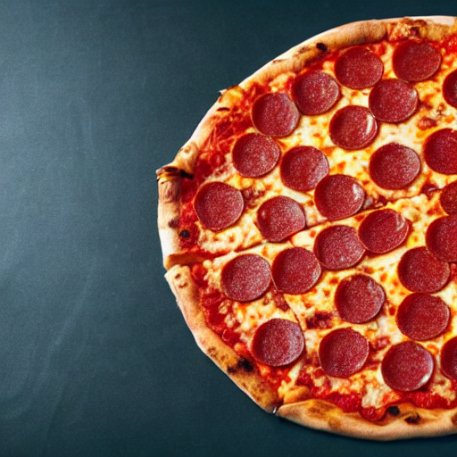

# Generate Images with Stable Diffusion

1. Load your `venv`

2. Install the dependencies

   ```bash
   pip install --upgrade 'diffusers[torch]' accelerate transformers
   ```

3. Run the following code

   ```python
   import torch
   from diffusers import DiffusionPipeline

   model_id = "runwayml/stable-diffusion-v1-5"

   pipeline = DiffusionPipeline.from_pretrained(model_id, torch_dtype=torch.float16, use_safetensors=True).to("cuda")

   prompt = "A picture of a Pepperoni Pizza on a restaurant table"

   image = pipeline(prompt).images[0]
   image.save("output.png")
   ```

   - Use `pipeline = DiffusionPipeline.from_pretrained(model_id, use_safetensors=True)` if your device does not support `torch.float16` or `torch.cuda`

4. Check the output image

   - Due to the random nature of the model, the output image may vary each time you run the code.

     - Some outputs may even be blocked by the internal moderation checks in the library, giving an error message like this:

       ```text
       Potential NSFW content was detected in one or more images. A black image will be returned instead. Try again with a different prompt and/or seed.
       ```

5. Implement a fixed seed with a `generator`

   ```python
   import torch
   from diffusers import DiffusionPipeline

   model_id = "runwayml/stable-diffusion-v1-5"

   pipeline = DiffusionPipeline.from_pretrained(model_id, torch_dtype=torch.float16, use_safetensors=True).to("cuda")

   generator = torch.Generator("cuda").manual_seed(123456789)

   prompt = "A picture of a Pepperoni Pizza on a restaurant table"

   image = pipeline(prompt, generator=generator).images[0]
   image.save("output.png")
   ```

   - The image should be exactly the same each time you run the code: 

6. Experiment with different prompts and configurations to generate various images
