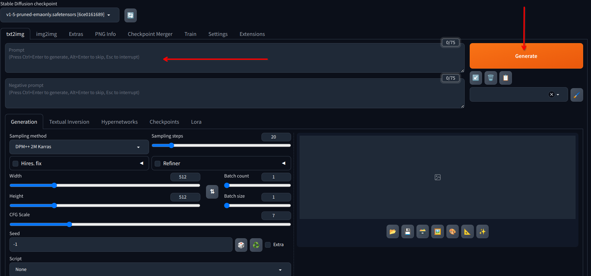
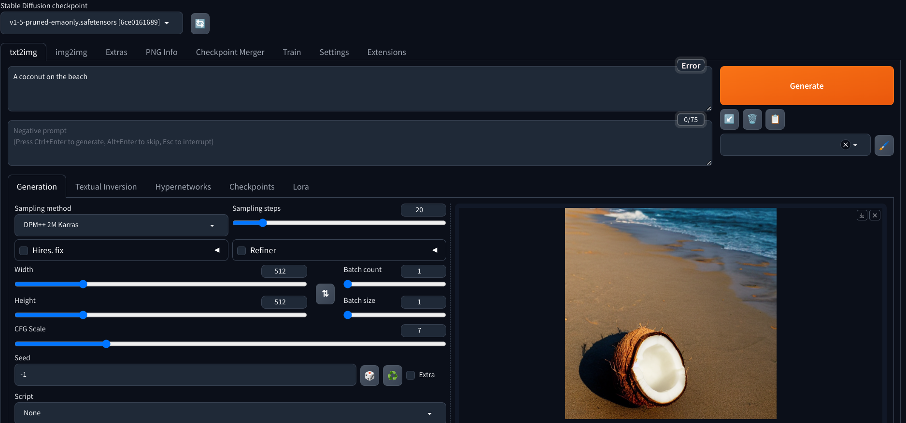

# Generate a Simple Image

1. Generate a simple image using the Stable Diffusion WebUI

   - Use the default model `v1-5-pruned-emaonly.safetensors`

   - Use the default `txt2image` tab

   - Leave all the `Generation` options as default

   - Input the prompt `A coconut on the beach` in the `Prompt` text area then click on the `Generate` button

   

2. After a few seconds (or minutes), the generated image will be displayed in the preview box

   
