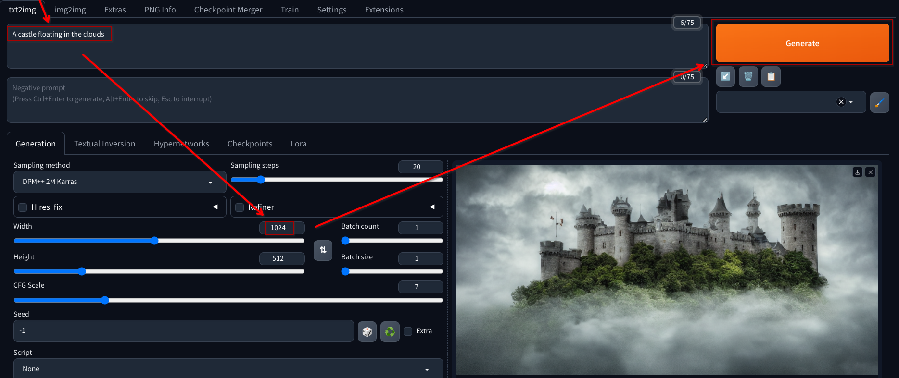
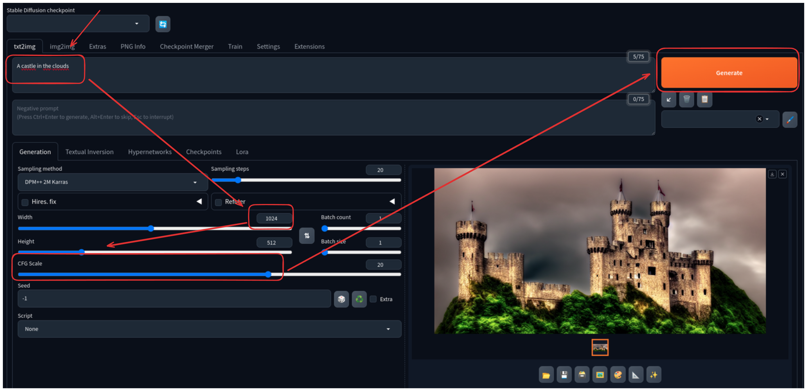

# Generate a Landscape Image

1. Generate a landscape image using the Stable Diffusion WebUI

   - Use the prompt `A castle floating in the clouds`

   - Configure the width and height to `1024x512`

   

2. Configure the prompt parameters for better results

   - Experiment with different prompts

   - Experiment with different sampling parameters

   - Experiment with different CFG scales

   
