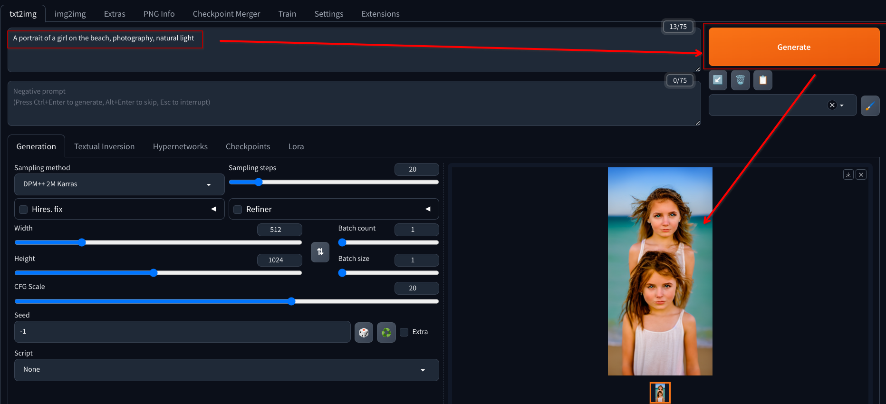

# Generate a Portrait Image

1. Generate a portrait image using the Stable Diffusion WebUI

   - Use the prompt `A portrait of a girl on the beach`

   - Configure the width and height to `512x1024`

   - Use `CFG Scale` of `20`

   - Click on the `Generate` button

   - Wait until the image is generated

   - Click in the in the pallet icon to send the image to the inpaint tab

   

   - The result should contain a portrait picture of a girls with some visible flaws

     - If the result is not satisfactory, try adding more terms to the prompt like `photography` and `natural light`

     - The resulting image quality may improve, but some distortions may still be present, like the one shown below

   

2. Use the `inpainting feature` to fix flaws and/or make changes in the face generated

   - In the right corner of the inpaint tab, click on the `use brush` button

   - Use the brush to select imperfections in the image and then click in the `Generate` button

   - Analyze the result and repeat the process by clicking on the palette icon to send the fixed image to the inpaint tab again if it was not satisfactory

   

   - If you want to remove elements of the image, try checking the `fill` option in the inpaint tab

   

   - Alternatively you can use the `latent noise` or `latent nothing` feature to generate a new element in the space using random noise or blank information to fill the masked area

     - This is specially helpful when combined with some prompt refinement to guide what should be generated to replace the masked region

   
