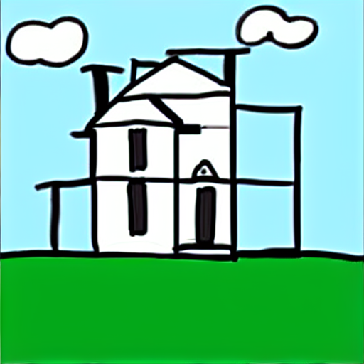

# Generate a Picture from a Sketch

1. Select the `img2img` tab

2. Select the `Sketch` tab in the `Generation` panel

3. Generate a picture from a sketch

   - Use the prompt `A photo of a house in a field`

   - Draw a crude sketch of a house in a field and upload it on the sketch tab

   

   - Click on the `Generate` button, see the result and adjust the prompt if needed

   

4. Try different parameters

   - Change the `CFG Scale` to control how strongly the model should adhere to the prompt description

   - Change the `Denoising strength` to control the amount of noise to add to the sketch

     - Values closer to `0` will generate images completely similar to the sketch

     - Values around `0.5` to `0.7` will generate images with little changes to the sketch, like changed lines or colors

     - Values up to `0.8` should keep a close resemblance to the sketch, but with more emphasis on the prompt description

     - Values above `0.8` might end up not resembling the sketch at all in most of the cases

   
