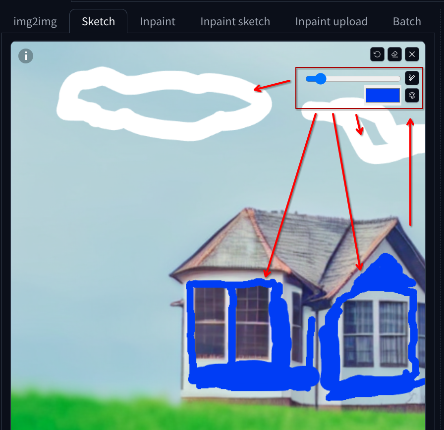
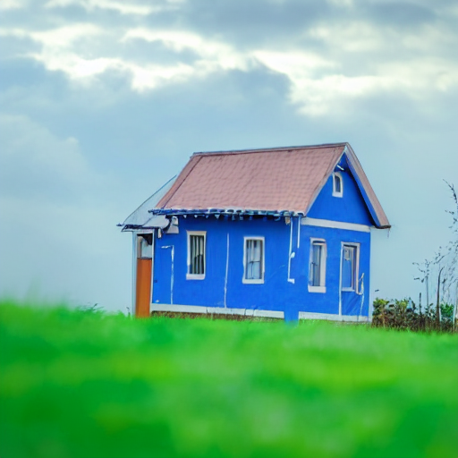

# Generate a Picture from a Sketch

1. Select the `img2img` tab

2. Select the `Sketch` tab in the `Generation` panel

3. Upload a picture to be edited

   - Use the house picture from the previous example

4. Sketch over the image to draw clouds in the sky and to paint the walls in blue

   - The sketch doesn't need to be perfect, just a rough idea of what you want to change

   

5. Refine the prompts and the parameters

   - Use the prompt `A photo of a blue house in a field, cloudy sky`

   - Use `CFG Scale` of `7`

   - Use `Denoising strength` of `0.6`

   - Hit the `Generate` button

   

6. Try different parameters

   - Change the `CFG Scale` to control how strongly the model should adhere to the prompt description

   - Change the `Denoising strength` to control the amount of noise to add to the sketch

     - Values closer to `0` will generate images completely similar to the sketch

     - Values around `0.5` to `0.7` will generate images with little changes to the sketch, like changed lines or colors

     - Values up to `0.8` should keep a close resemblance to the sketch, but with more emphasis on the prompt description

     - Values above `0.8` might end up not resembling the sketch at all in most of the cases
