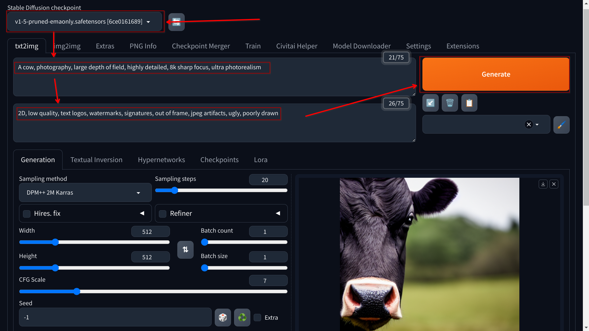

# Photorealistic Image Generation

1. Reuse the Image Generation python script

2. Load a model suitable for photorealistic image generation

   - You may want to configure your environment variables to load the model using less VRAM, for example `"--api --xformers --lowvram --always-batch-cond-uncond"`

3. Configure a prompt for the API to generate a photorealistic image

   - Append `, photography, large depth of field, highly detailed, 8k sharp focus, ultra photorealism` to the prompt

   - Use a negative prompt like `2D, low quality, text logos, watermarks, signatures, out of frame, jpeg artifacts, ugly, poorly drawn`

   - Code the payload to include the positive and negative prompts

   ```python
   prompt = input("Type your prompt:\n")

   payload = {
       "prompt": f"{prompt}, photography, large depth of field, highly detailed, 8k sharp focus, ultra photorealism",
       "negative_prompt": "2D, low quality, text logos, watermarks, signatures, out of frame, jpeg artifacts, ugly, poorly drawn"
   }
   ```

   - Use the payload in the API call

4. Test the Prompt in the Stable Diffusion WebUI before running the script

   

5. Run the script to generate a photorealistic image
