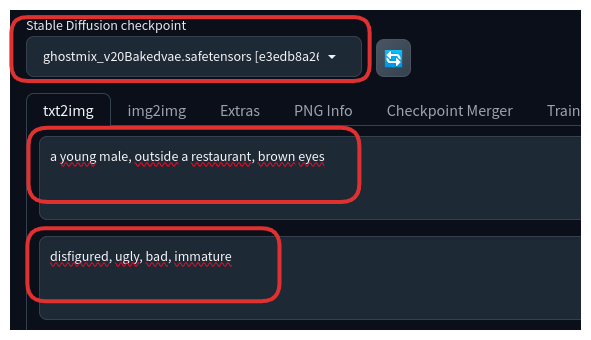
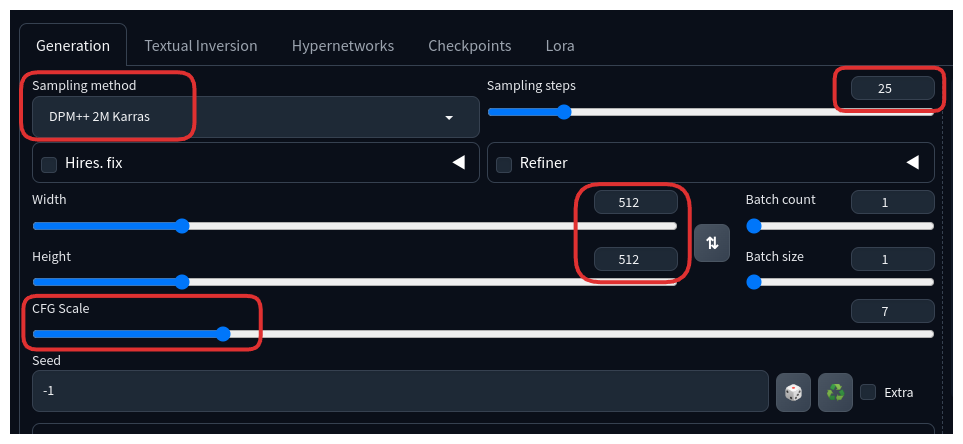
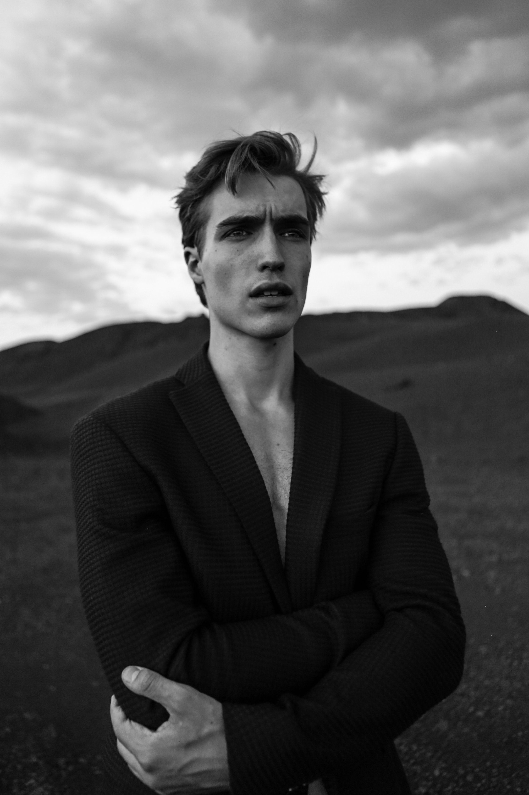
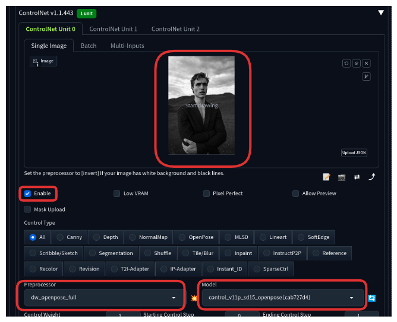
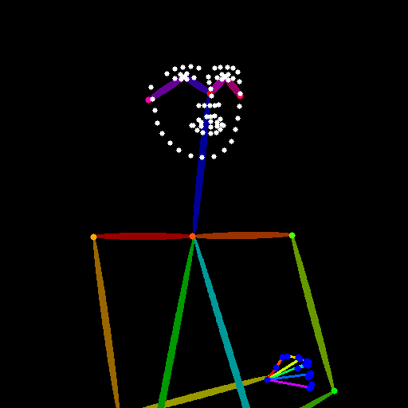
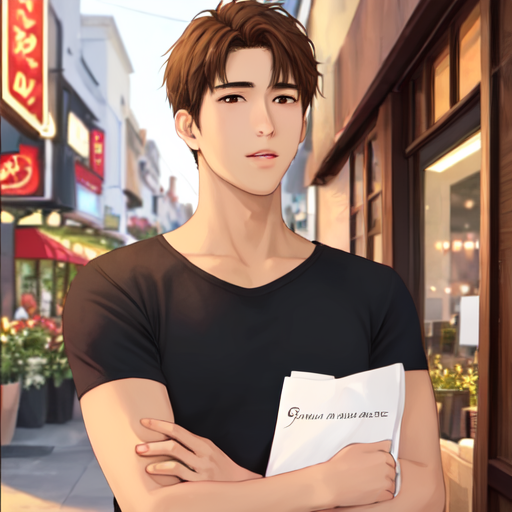
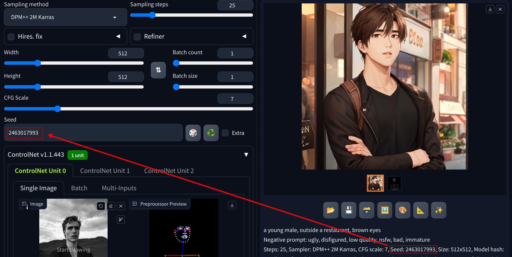
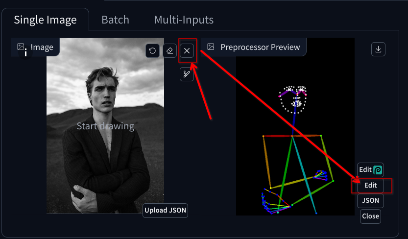
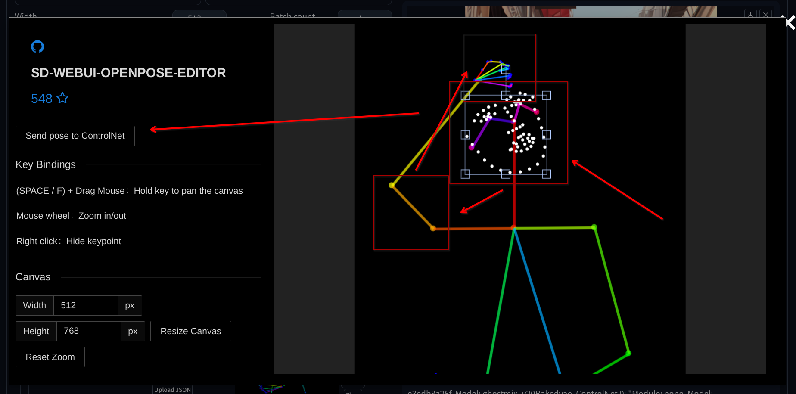
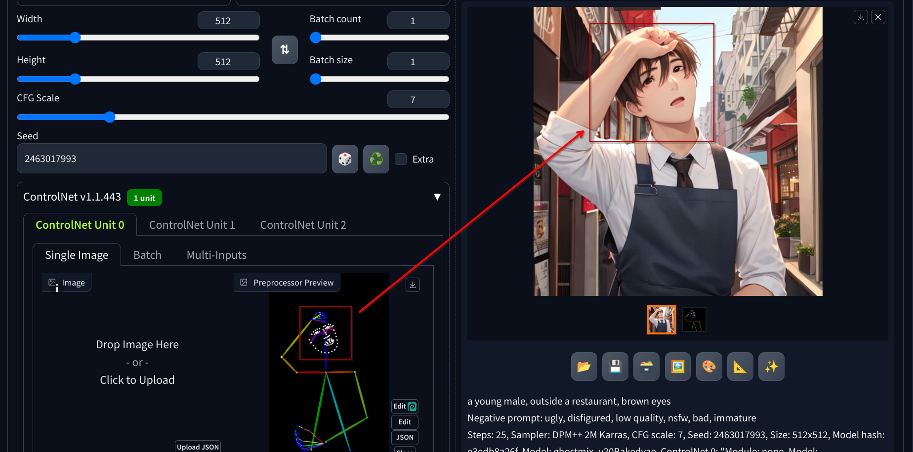

# Generating an image with a specific human pose using ControlNet

1. Download a model to use as `Stable Diffusion checkpoint`

   - Download [Ghostmix](https://civitai.com/models/36520/ghostmix) model using [this link](https://civitai.com/api/download/models/76907?type=Model&format=SafeTensor&size=pruned&fp=fp16)

   - Place the downloaded file in the `stable-diffusion-webui/models/Stable-diffusion` directory

2. Download a model to use with `ControlNet openpose` preprocessor

   - Download `control_v11p_sd15_openpose.pth` model [here](https://huggingface.co/lllyasviel/ControlNet-v1-1/resolve/main/control_v11p_sd15_openpose.pth?download=true)

   - Place the downloaded file in the `stable-diffusion-webui/extensions/sd-webui-controlnet/models` directory

     - Instead of downloading each model separately, you could download all the 14 models from the [ControlNet-v1-1](https://huggingface.co/lllyasviel/ControlNet-v1-1) page by cloning the repository using [git lfs](https://git-lfs.com)

       - After cloning the repository, you can configure the correct path to the model in the `ControlNet` settings, under the `Uncategorized` section in the `settings` tab

3. Select the model to use as the `Stable Diffusion checkpoint`

   - Click on the refresh icon and select `Ghostmix`. This will set the model that we downloaded in step 1 as the `Stable Diffusion checkpoint`

     - You might need to load the model using the `--medvram` or `--lowvram` flag if you are running process on a machine with low VRAM in your GPU

   - Use `a young male, outside a restaurant, brown eyes` as the prompt and `ugly, disfigured, low quality, nsfw, bad, immature` as the negative prompt

   

4. Use the following settings in the `Generation` tab:

   - Sampling Method: `DPM++ 2M Karras`

   - Sampling Steps: `25`

   - Width: `512`

   - Height: `512`

   - CFG Scale: `7`

   - 

5. Configure ControlNet

   - On the text2img page, expand the ControlNet section. You should see an empty image canvas under ControlNet Unit 0 > Single Image.

   - Upload the `pose.jpg` file located inside the `images` folder of this directory

     

   - Mark the `Enable` checkbox

   - Use the following settings:

     - Preprocessor: `Dw_openpose_full`

     - ControlNet Model: `Control_v11p_sd15_openpose [cab727d4]`

     

6. Press the `Generate` button to view the result

   - The preprocessor should be able to extract the pose from the uploaded image and generate a "skeleton" that will be used to generate the final image

     

   - The ControlNet model will then use the pose information to generate an image conforming to these instructions

     

7. Copy the `Seed` value from the generated image and paste it in the `Seed` field in the `Generation` tab

   

   - The output image should always look similar in subsequent generations when locking the seed

8. Modify the pose with the `OpenPose Editor`

   - You can remove the initial image since the pose is already extracted

   - Select the `Edit` button to open the `OpenPose Editor`

   

9. Edit the pose until you have the desired result

   

   - You may drag each node to adjust the pose as desired

   - You can select groups of nodes to move, rotate and resize them together, useful for complex features like faces and hands

   - Once you are satisfied with the pose, press the `Send pose to ControlNet` button to save the changes

10. Press the `Generate` button to generate another image

    

    - By locking the seed value, the generated person should look very alike to the previous one, but with the new pose

    - This way you can generate different images of the same fictional character in different poses without having to manually edit one by one in a graphic editor

    - You can repeat the process with little incremental changes to create frames of a video animation
