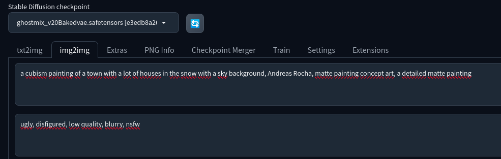
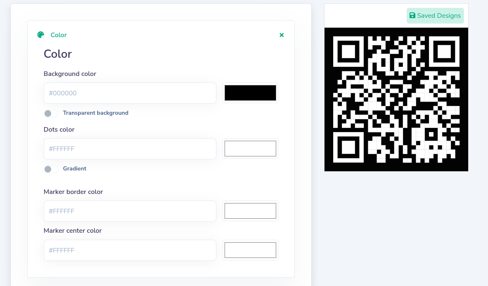
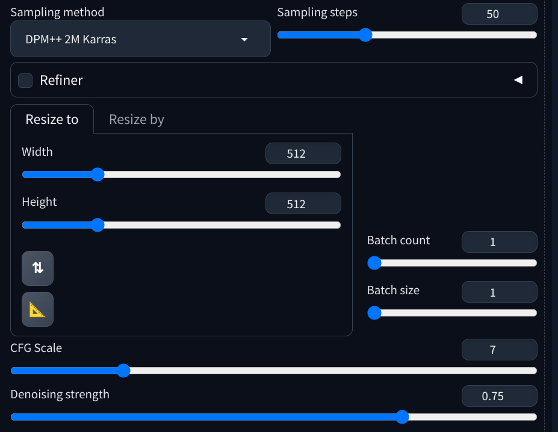
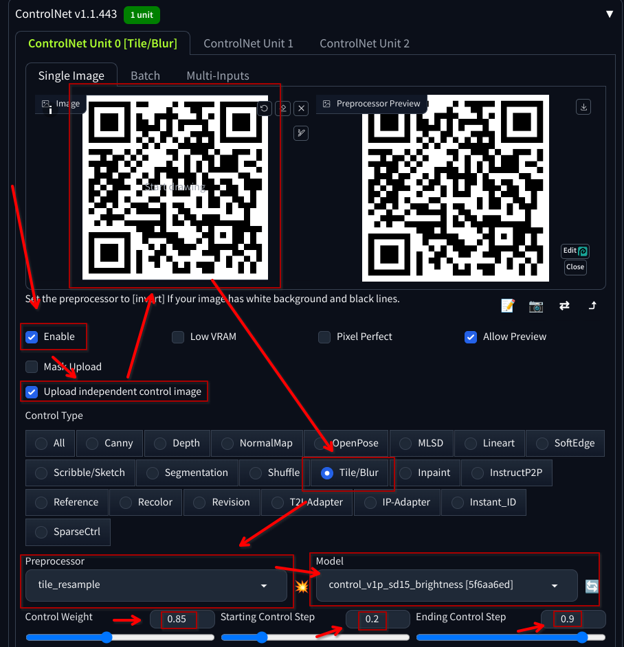
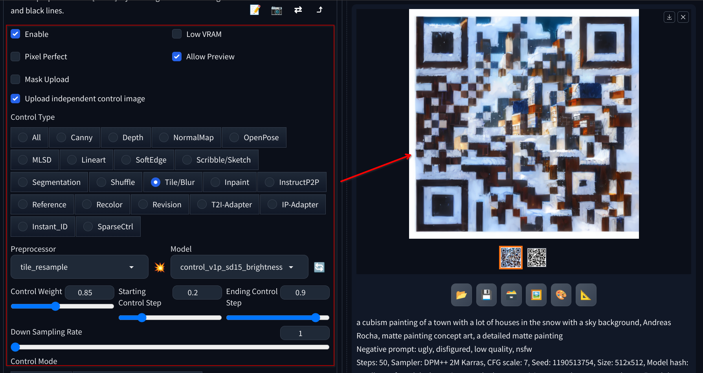
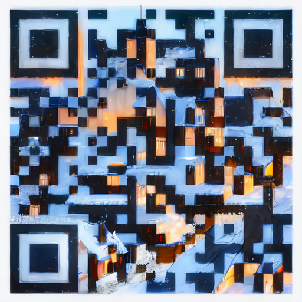

# Generating a QRCode with ControlNet extension

1. Download the `Brightness Control` model

   - Download the [Brightness Control](https://huggingface.co/latentcat/control_v1p_sd15_brightness) model [here](https://huggingface.co/ioclab/ioc-controlnet/resolve/main/models/control_v1p_sd15_brightness.safetensors)

   - Put the downloaded file in ControlNet models folder located at `stable-diffusion-webui/extensions/sd-webui-controlnet/models`

2. Select the model and enter the image-to-image setting

   - Click on the refresh icon and select `Ghostmix` (the same model we used in the previous exercise)

   - Use `a cubism painting of a town with a lot of houses in the snow with a sky background, Andreas Rocha, matte painting concept art, a detailed matte painting` as the prompt and `ugly, disfigured, low quality, nsfw` as the negative prompt

   - 

3. Generate a QR code

   - Generate a QR code using any website like [this](https://www.the-qrcode-generator.com/) or [this](https://qr.io/)

   

   - Your QR code should be saved in a good resolution file

   

   - Before proceeding, make sure the QR code is readable by using a QR code reader app on your phone or any similar device

4. Use the following settings in the `Generation` tab:

   - Sampling Method: `DPM++ 2M Karras`

   - Sampling Steps: `50`

   - Width: `512`

   - Height: `512`

   - CFG Scale: `7`

   - Denoising strength: `0.75`

   - 

5. Configure ControlNet

   - On the `img2img` page, expand the `ControlNet` section

   - Click on `Upload independent control image` checkbox

     - You should new see an empty image canvas under `ControlNet Unit 0` named `Single Image`

   - Upload the QR code to the Image Canvas

   - Mark the `Enable` checkbox

   - Use the following settings:

     - Control Type: `Tile/Blur`

     - Preprocessor: `Tile resample`

     - ControlNet Model: `Control_v1p_sd15_brightness [5f6aa6ed]`

     - Control Weight: `0.85`

     - Starting Control Step: `0.2`

     - Ending Control Step: `0.9`

     - 

6. Press the `Generate` button to view the result

   - The result should be a QR code image decorated with the style of the prompt passed

   

   - Example:

   
