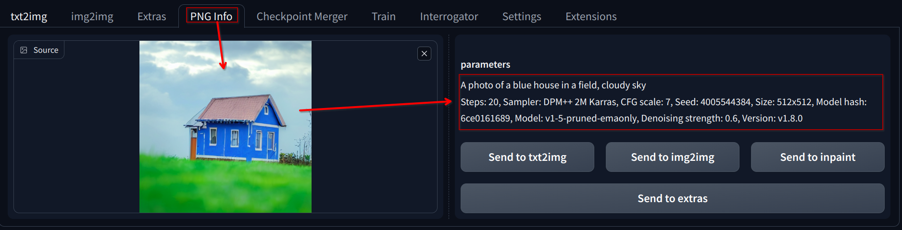
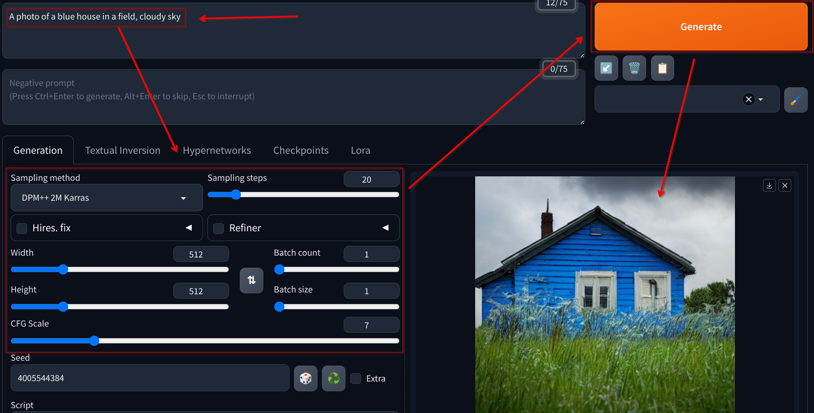
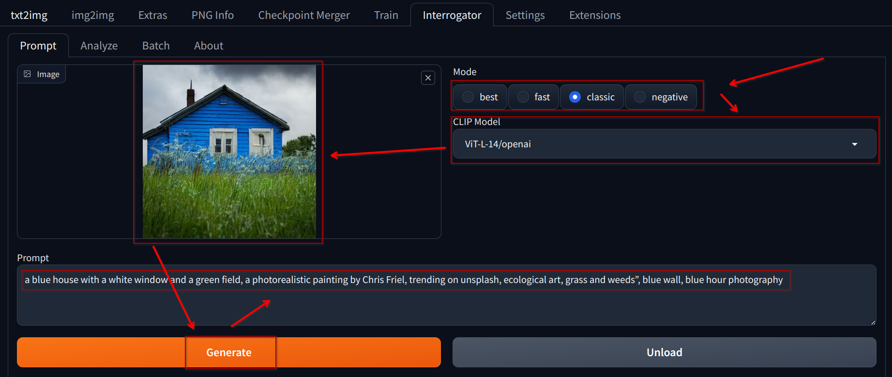
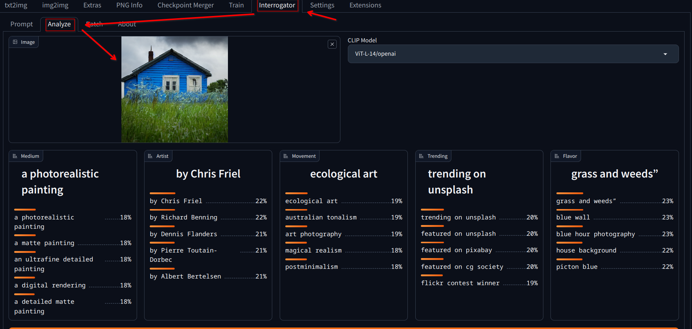
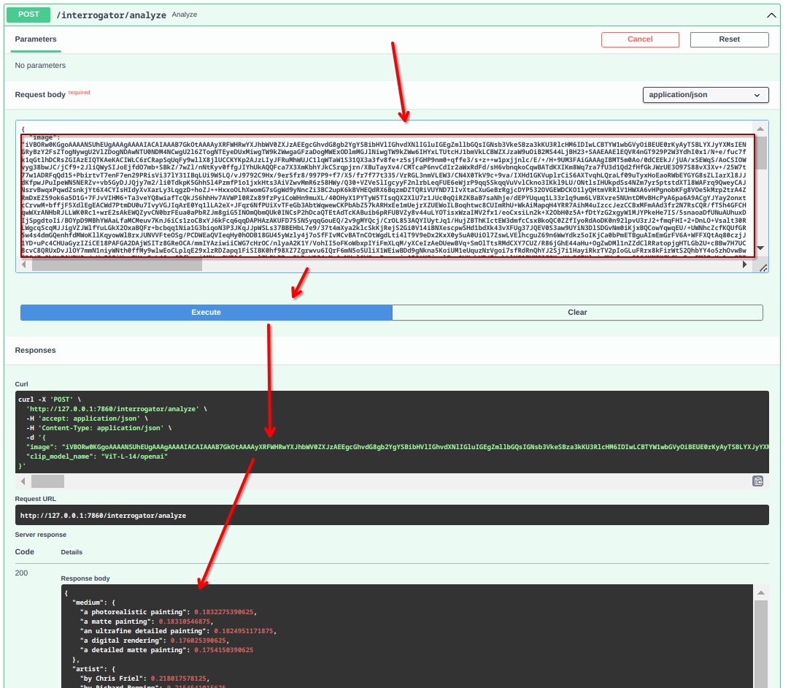

# Exploring the Image to Text Features of the Stable Diffusion WebUI

1. Run the Stable Diffusion WebUI

   - Make sure that the `--api` flag is enabled, since we're going to use some of the API endpoints to extract text information from images later

2. Open the WebUI in your browser

3. Open the `PNG Info` tab

   - This tab allows you to upload an image and extract any metadata saved in the file

4. Upload an AI generated image

   - You can use any image you've generated in the previous lessons

   - The `parameters` should appear in the right pane after uploading the image

   

   - You can now send the `prompt` and `parameters` to the `text2image` tab to see how the generation parameters behave

   

5. Enable the [Clip Interrogator Extension](https://github.com/pharmapsychotic/clip-interrogator-ext)

   - Download the extension from the `Available` tab in the `Extensions` section of the WebUI

   - Search for `clip interrogator`

   - After installing, click on `Apply and restart UI`

6. Run the `Prompt` interrogator in the `Interrogator` section

   - Select a `Clip Model` from the dropdown

   - Select a suitable `Mode`

     - The `best` and `negative` settings are the heaviest, requiring more VRAM to run

     - The `classic` and `fast` can be run more easily, but they dive more simplistic descriptions about the prompts

   - Upload the image to be analyzed

   - Click on `Generate`

   - This will allow you to see the `prompt` that the model better relates the image to

   

7. Run the `Analyze` interrogator in the `Interrogator` section

   - This tool allows to analyze the relationship between many terms in the categories of `Medium`, `Artist`, `Movement`, `Trend` and `Flavor`

   - The percentual values are the model's confidence in the relationship between the image and the term, ranked between 0 and 1, according to the array of most probable results that the model has generated

   

8. Navigate to the swagger documentation

   - Access the `http://127.0.0.1:7860/docs` URL in your browser

   - The `Swagger` tab allows you to see the API documentation for the WebUI

   - You can see the available endpoints and the parameters that can be used to interact with the WebUI

9. Scroll down to the `interrogator/analyze` endpoint and input the payload

   - The image file information must be passed in `base64 string` format for the API to process it

   - In Linux you can quickly copy the `base64` contents of a image by running this command:

   ```bash
   base64 ./img.png -w0 | xclip -selection clipboard
   ```

10. Call the API passing the file information in the body

    

    - The response will be the same as the `Analyze` interrogator

    - You can use this endpoint to automate the process of extracting information from images and integrate this in your applications

    - Example output:

    ```json
    {
      "medium": {
        "a photorealistic painting": 0.1832275390625,
        "a matte painting": 0.18310546875,
        "an ultrafine detailed painting": 0.1824951171875,
        "a digital rendering": 0.176025390625,
        "a detailed matte painting": 0.1754150390625
      },
      "artist": {
        "by Chris Friel": 0.218017578125,
        "by Richard Benning": 0.2154541015625,
        "by Dennis Flanders": 0.2117919921875,
        "by Pierre Toutain-Dorbec": 0.211669921875,
        "by Albert Bertelsen": 0.2113037109375
      },
      "movement": {
        "ecological art": 0.1898193359375,
        "australian tonalism": 0.1890869140625,
        "art photography": 0.188232421875,
        "postminimalism": 0.18359375,
        "magical realism": 0.1837158203125
      },
      "trending": {
        "trending on unsplash": 0.1983642578125,
        "featured on unsplash": 0.1981201171875,
        "featured on pixabay": 0.19677734375,
        "featured on cg society": 0.196044921875,
        "flickr contest winner": 0.1878662109375
      },
      "flavor": {
        "grass and weeds”": 0.2308349609375,
        "blue wall": 0.22900390625,
        "blue hour photography": 0.2255859375,
        "house background": 0.224609375,
        "picton blue": 0.222900390625
      }
    }
    ```
